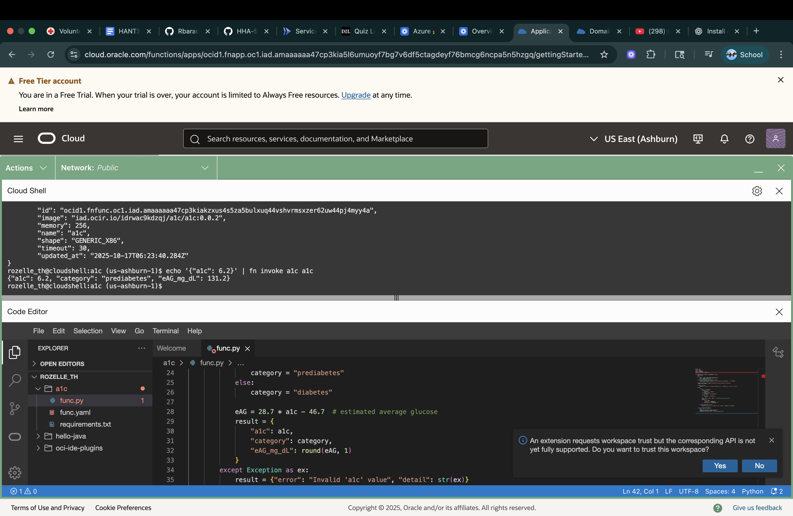

# 504_serverless_functions
### Loom
- URL:

GCP & OCI

### Deployment Overview:
##### Google Cloud Platform (GCP)
The A1C classification function was deployed on **Google Cloud Functions**.   
I used the Google Cloud Console to upload the Python script and enable an HTTP trigger.  
Authentication was set to **unauthenticated**, allowing public access for testing.

#### Oracle Cloud Infrastructure (OCI)
The same function was containerized and deployed using **Oracle Functions** in the us-ashburn-1 region.  
The deployment involved building a Docker image, pushing it to the OCI Container Registry, and then deploying through the **Fn Project CLI**.  
This environment uses **key-based authentication**, which provides tighter security controls for enterprise settings.

### URLs
- GCP: 'https://python-gcp-561326745061.europe-west1.run.app'
- OCI:'https://ncpa5n5hzgq.us-ashburn-1.functions.oci.oraclecloud.com/20181201/functions/ocid1.fnfunc.oc1.iad.amaaaaaa47cp3kiakzxus4s5za5bulxuq44vshvrmsxzer62uw44pj4myy4a/actions/invoke' 

### Screenshots:

### Comparison 
Both GCP & OCI successfully hosted the A1C classification function, but they differ in user experience and configuration depth. GCP offered a faster and easier process, which was more ideal for me. Its unauthenticated HTTP trigger allowed for immediate testing without additional setup, and the built-in monitoring and logging tools simplified troubleshooting. 

In contrast, OCI required more setup effort but provided greater control and security. Deploying through Oracle Functions involved containerizing the application, configuring a private image registry, and using key-based authentication for access. The function performed reliably once deployed. 

I would choose GCP over OCI. OCI is a little tricky to figure and took longer than expected versus GCP. I found a youtube video that I will link that really helped figure it out. 
- URL: 'https://www.youtube.com/watch?v=ogCK9RIWeuI'
- I also couldn't use Azure yet as my subscription hasn't been resolved yet. 

